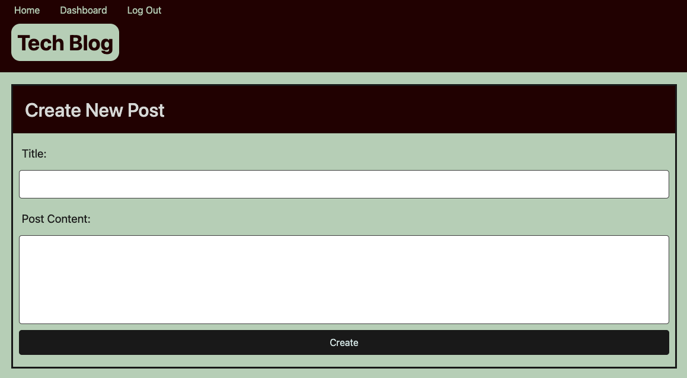

# 14-Tech-Blog
[](https://opensource.org/licenses/MIT)

## To-Do
* spaces between username on homepage
* dates to display
* edit/delete posts/comments
* need logout to display when logged in (mainly on homepage)
* get to work on Heroku
* if time allows: make user-page


## Table of Contents
* [Introduction](#introduction)
* [Functionality](#functionality)
* [Tasks Completed](#tasks-completed)
* [Technologies Used](#technologies-used)
* [Installations](#installations)
* [Demos](#demos)
* [Future Ideas](#future-ideas)
* [Sources](#sources)
* [License](#license)


 ## Introduction
 Uses MySql, Routes, and Handlebars to create an app allowing users to view, edit, and make blog posts. Users can also create accounts and track their blog posts through there.
 * GitHub Repository: https://github.com/JXIong15/14-tech-blog
 * Heroku Live App: https://tech-blog-jx.herokuapp.com/
<p align="center"></p>


## Functionality
* When the program is initiated, the home page is deployed, which includes existing blog posts if any have been posted; navigation links for the homepage and the dashboard; and the option to log in
* When I click on the navigation links, then I am prompted to either sign up or sign in
* WHEN I choose to sign up, then I am prompted to create a username and password that is then saved into the database. I am then taken to the login page.
* WHEN I revisit the site at a later time and choose to sign in, then I am prompted to enter my username and password
* Once signed in, the user can see the normal navigation links, and they have the option to log out
* WHEN I click on the homepage option in the navigation, THEN I am taken to the homepage and presented with existing blog posts that include the post title and the date created
    * WHEN I click on an existing blog post, THEN I am presented with the post title, contents, post creator’s username, and date created for that post and have the option to leave a comment
    * WHEN I enter a comment and click on the submit button while signed in, THEN the comment is saved and the post is updated to display the comment, the comment creator’s username, and the date created
    * `NEW POSTS/COMMENTS DON'T WORK YET`
* WHEN I click on the dashboard option in the navigation, THEN I am taken to the dashboard and presented with any blog posts I have already created and the option to add a new blog post
    * WHEN I click on the button to add a new blog post, THEN I am prompted to enter both a title and contents for my blog post
    * WHEN I click on the button to create a new blog post, THEN the title and contents of my post are saved and I am taken back to an updated dashboard with my new blog post (`DOES NOT WORK YET`)
    * WHEN I click on one of my existing posts in the dashboard, THEN I am able to delete or update my post and taken back to an updated dashboard (`DOES NOT WORK YET`)
* WHEN I click on the logout option in the navigation, THEN I am signed out of the site
* To run the database and seed data:
```
mysql -h HOSTNAME -u USER DATABASE < ./db/schema.sql
npm run seed
```


## Tasks Completed
* Dowloaded necessary NPM packages. View [Installations](#installations) below for exact packages.
* Created a connection between the database and server using MySql.
* Created models, routes, and seed data.
* Used Handlebars to make HTML templates for desired displays.
* JavaScript files to help direct routes accordingly.
* required login and authorization

<p align="center"></p>
<p align="center">(Create Blog Post Example)</p>


## Installations
* Download NPM and packages:
  * Bcrypt
  * connect-session-sequelize
  * dotenv
  * express
  * express-handlebars
  * express-session
  * mysql2
  * sequelize


## Technologies Used
* JavaScript
* NPM Packages
* Terminal/Command Line (to interact with the questions)
* MySql Workbench
  * Query Conenection
* MySql Server
* Insomnia/routing
* Handlebars
* Heroku


## Demos
* App Demo:
   <p align="center"></p>


## Future Ideas
* Allow users to update their account info (change password)
    * Would need a profile page for this
* figure out how to have the title and date on the same line
* add notification option, so users can see new comments on their posts and posts they've commented on
* add number of comments to the home page posts
* add user github and social media, which they can edit in their profile


## Sources
* NPM Packages: https://www.npmjs.com/
* MySql Workbench: https://www.mysql.com/products/workbench/
* MySql Server: https://dev.mysql.com/downloads/mysql/
* Heroku: https://heroku.com
* Insomnia: https://insomnia.rest/download


## License
Licensed under the [MIT License](LICENSE).

<p align="center">© 2021 Jou Xiong, Trilogy, Northwestern Coding Bootcamp</p>
