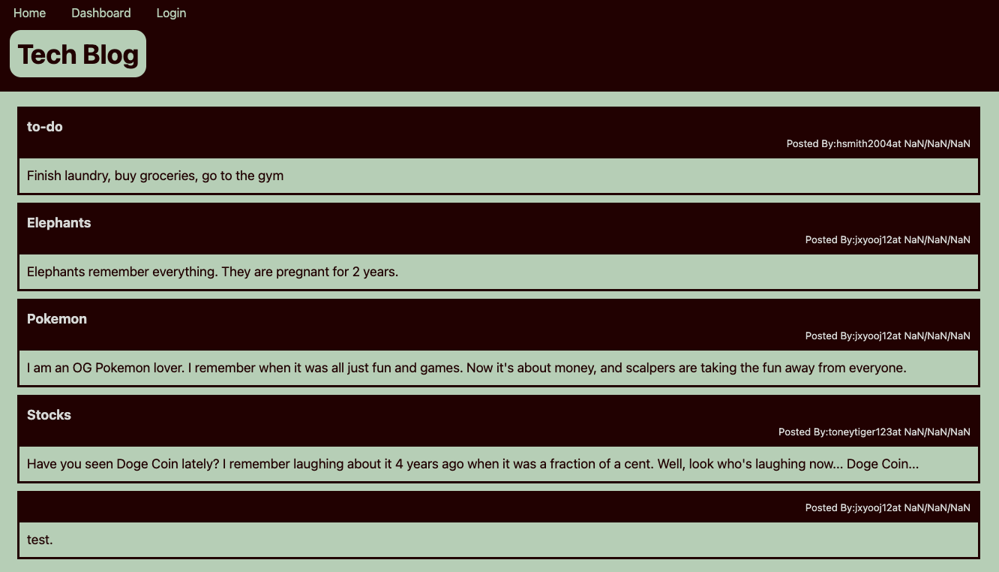

# 14-Tech-Blog
[](https://opensource.org/licenses/MIT)

## To-Do
* need Sign Up to save to the DB
* get comments to post when the button is clicked
* get comments per post to display
* spaces between username on homepage
* dates to display
* edit/delete posts
* need logout to display when logged in (mainly on homepage)


## Table of Contents
* [Introduction](#introduction)
* [Functionality](#functionality)
* [Tasks Completed](#tasks-completed)
* [Technologies Used](#technologies-used)
* [Installations](#installations)
* [Demos](#demos)
* [Future Ideas](#future-ideas)
* [Sources](#sources)
* [License](#license)


 ## Introduction
 Uses MySql, Routes, and Handlebars to create an app allowing users to view, edit, and make blog posts. Users can also create accounts and track their blog posts through there.
 * GitHub Repository: https://github.com/JXIong15/14-tech-blog
 * Heroku Live App: https://tech-blog-jx.herokuapp.com/
<p align="center"></p>


## Functionality
* When the program is initiated, the home page is deployed.
```
mysql -h HOSTNAME -u USER DATABASE < ./db/schema.sql
npm run seed
```


## Tasks Completed
* Dowloaded necessary NPM packages. View [Installations](#installations) below for exact packages.
* Created a connection between the database and server using MySql.
* 

<p align="center"></p>
<p align="center">(Create Blog Post Example)</p>


## Installations
* Download NPM and packages:
  * Bcrypt
  * connect-session-sequelize
  * dotenv
  * express
  * express-handlebars
  * express-session
  * mysql2
  * sequelize


## Technologies Used
* JavaScript
* NPM Packages
* Terminal/Command Line (to interact with the questions)
* MySql Workbench
  * Query Conenection
* MySql Server
* Insomnia/routing
* Handlebars
* Heroku


## Demos
* App Demo:
   <p align="center"></p>


## Future Ideas
* Allow users to update their account info (change password)
    * Would need a profile page for this
* figure out how to have the title and date on the same line
* add notification option, so users can see new comments on their posts and posts they've commented on
* add number of comments to the home page posts
* add user github and social media, which they can edit in their profile


## Sources
* NPM Packages: https://www.npmjs.com/
* MySql Workbench: https://www.mysql.com/products/workbench/
* MySql Server: https://dev.mysql.com/downloads/mysql/
* Heroku: https://heroku.com
* Insomnia: https://insomnia.rest/download


## License
Licensed under the [MIT License](LICENSE).

<p align="center">© 2021 Jou Xiong, Trilogy, Northwestern Coding Bootcamp</p>